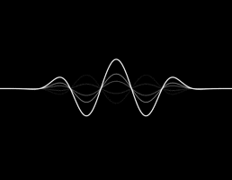

# Sound Waves View in Swift



## Usage

```swift
let waveView = SwiftyWaveView(frame: CGRect(x: 0, y: 0, width: 200, height: 100))
view.addSubview(waveView)
waveView.start()
```

### Code

```swift
let waveView = SwiftyWaveView(frame: CGRect(x: 0, y: 0, width: 100, height: 50))
self.view.addSubview(waveView)
waveView.start()
```

### Storyboard


##License

SwiftyWave is released under the WTFPL license. (Do What the Fuck You Want to Public License)

